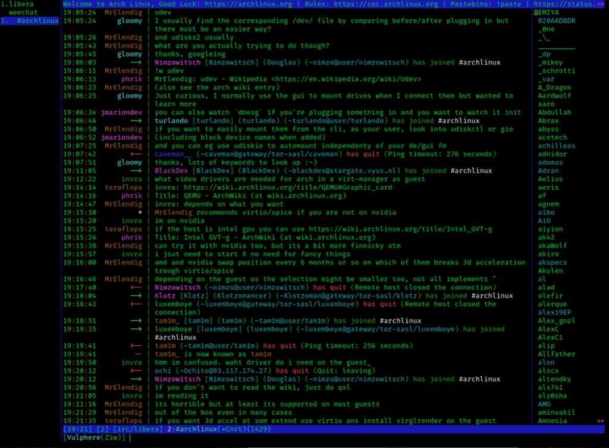

# Decentralized Peer-to-Peer Network using Kademlia DHT

## Abstract

Decentralized networks is a hot topic in the current era of digitalisation, especially where privacy and security meets its highest requirements.

The program I made named "go2pee", is a terminal-based peer to peer messaging network inspired by the infamous IRC Weechat (internet relay chat), which was designed as a client-server model. This project was made so that I could redesign the classic IRC into a peer to peer network.

 

</img>

## Overview

The program was implemented using Kademlia's DHT algorithm, which is a distributed hash table for user discovery and message routing without relying on central servers.

The codebase is written in Golang.

## Installation

Click on the releases tab to download the latest version of the application. It's already compiled as an executable.

## Usage

Upon running the application, you will be brought into the global chat. This is where you meet people using the peer-to-peer network.

### Messaging a specific node

There will be a file generated upon launching the application. This file will be known as a "tagline", this will include all the route to your friends' network address which will then be used for you to communicate. Remember, both peers need to have each others address in the tagline inorder to communicate.
